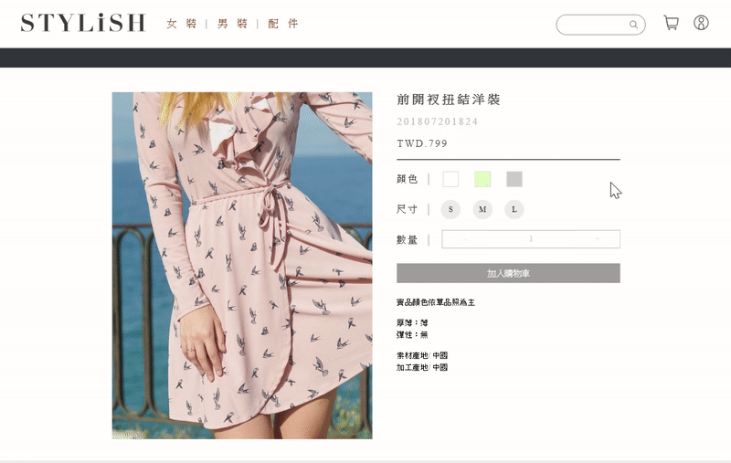
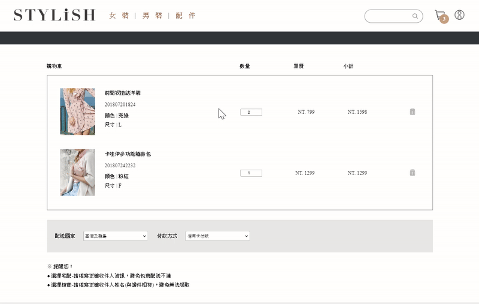

# Stylish--clothing-e-commerce

## Link
https://houy062924.github.io/Stylish--clothing-e-commerce/

## Introduction
Stylish is a clothing e-commerce site that allows users to purchase the latest trend.

## Functionality
The site implements features that include
  * a product searching function that can let you quickly find what you want,
  * a shopping cart that stores products and their respective colors & sizes,
  * a payment system to that accept credit card purchases, and
  * an membership system that can keep track of your past purchases.

## Technologies Used

 - Fundamental Languages
    * HTML
    * CSS
    * JavaScript
    * RWD
 - Networking
    * Back-End API
    * AJAX
 - Web Storage
    * LocalStorage
    * Cache
 - Other
    * Authentication : Facebook SDK
    * Payment : TapPay
    * Infinite scroll
    * Image carousel

## Site Demo

**Home Page**
  * Implemented infinite scroll as pagination method
  

**Product Page**

**Shopping Cart Page**

**Additional Features**
  * Implemented in collaboration with Back-End and Android team
  

